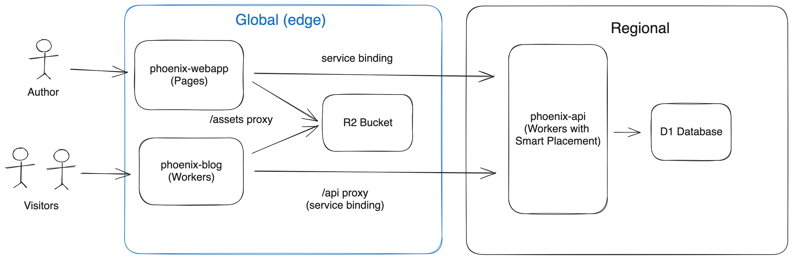

# cloudflarebook.com

This folder contains the code running at [cloudflarebook.com](https://cloudflarebook.com).

## Architecture




## Deploy in your Cloudflare account

You need 1 domain, let's say `example.com` already setup on Cloudflare.


Create D1 database
- add schema.sql

Create Pages applications (from browser)


```bash
$ make install_ci
$ make deploy
```

- add env to api
    - JWT SECRET


- connect api to webapp
- add custom domain to webapp

- add workers route to blog


Make sure that you have Node.js installed (see `.devcontainer/Dockerfile` for and example of setup).

Then, in the root folder of this repository, run:
```bash
$ make install_ci
$ make deploy
```

Create a D1 database named `cloudflarebook`: `Workers & Pages` > `D1`.

In your Cloudflare dashboard, go to `Workers & Pages` > `cloudflarebook-api` > `Settings` > `Variables`.

Create the following Environment Variable:

```
Variable name: JWT_SECRET
Value: [See cloudflarebook-api/env.example to learn how to generate a secure secret key]
Encrypt: true
```

Then go to `Workers & Pages` > `cloudflarebook-webapp` > `Settings` > `Functions` > `Service bindings` and add:
```
Variable name: api
Service: cloudflarebook-api
```

Then in `Workers & Pages` > `cloudflarebook-webapp` > `Custom Domains` add: `example.com`

Then in `Workers & Pages` > `cloudflarebook-blog` > `Custom Domains` add: `blog.example.com`

<!--
Go to your Cloudflare zone for `example.com` > `Workers Routes` and add a Route:
```
Route: blog.example.com/*
Worker: cloudflarebook-blog
``` -->


## Development

Make sure that you have Node.js installed (see `.devcontainer/Dockerfile` for and example of setup).

Go to `cloudflarebook-api`.

Create a `.dev.vars` with the same variables from `env.example`, but with valid values.

Then run:
```bash
$ npm install
$ npm run dev
```

In a second terminal, go to `phoenix-blog` and run:
```bash
$ npm install
$ npm run dev
```

In a thirs terminal, go to `phoenix-webapp` and run:
```bash
$ npm install
$ npm run dev
```
