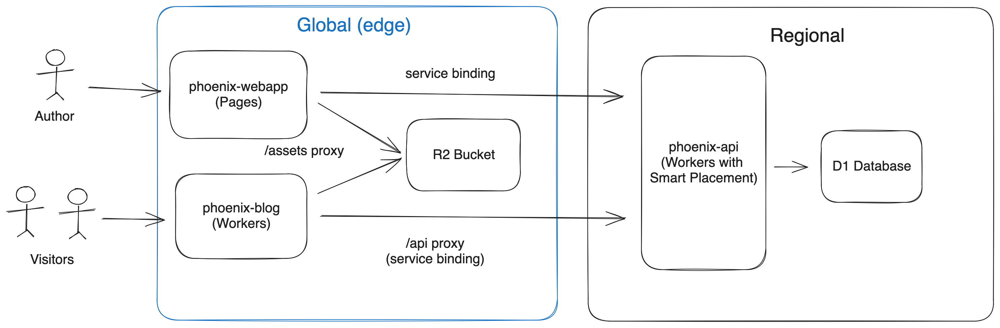

# Phoenix

## Architecture




## Deploy in your Cloudflare account

You need 2 domains, let's say `phoenix.com` and `phoenix.blog` already setup on Cloudflare.

Make sure that you have Node.js installed (see `.devcontainer/Dockerfile` for and example of setup).

Then, in the root folder of this repository, run:
```bash
$ make install_ci
$ make deploy
```

Create a D1 database named `phoenix`: `Workers & Pages` > `D1`.

In your Cloudflare dashboard, go to `Workers & Pages` > `pingoo-api` > `Settings` > `Variables`.

Create the following Environment Variable:

```
Variable name: JWT_SECRET
Value: [See phoenix-api/env.example to learn how to generate a secure secret key]
Encrypt: true
```

Then go to `Workers & Pages` > `pingoo-webapp` > `Settings` > `Functions` > `Service bindings` and add:
```
Variable name: api
Service: phoenix-api
```

Then in `Workers & Pages` > `pingoo-webapp` > `Custom Domains` add: `phoenix.com`


Go to your Cloudflare zone for `phoenix.blog` > `Workers Routes` and add a Route:
```
Route: */*
Worker: phoenix-blog
```


## Development

Make sure that you have Node.js installed (see `.devcontainer/Dockerfile` for and example of setup).

Go to `phoenix-api`.

Create a `.dev.vars` with the same variables from `env.example`, but with valid values.

Then run:
```bash
$ npm install
$ npm run dev
```

In a second terminal, go to `phoenix-blog` and run:
```bash
$ npm install
$ npm run dev
```

In a thirs terminal, go to `phoenix-webapp` and run:
```bash
$ npm install
$ npm run dev
```
